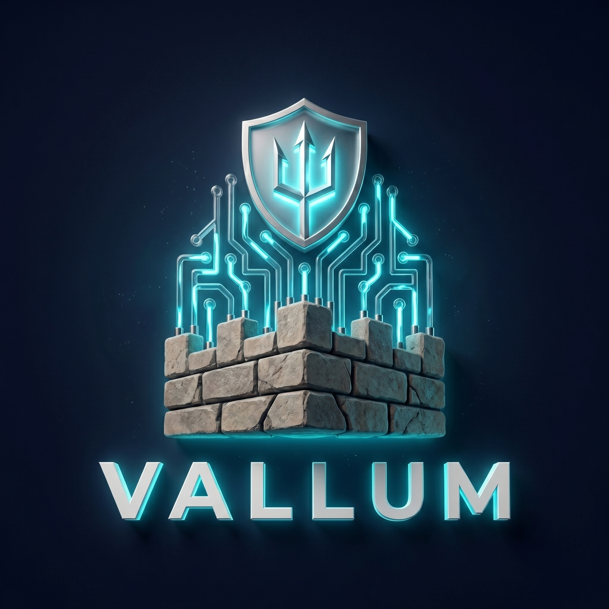
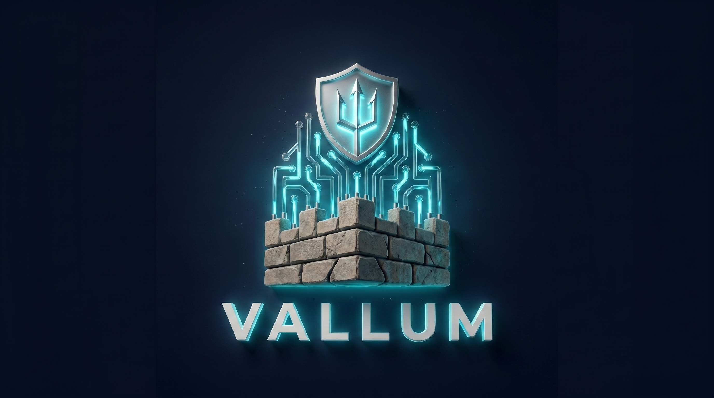
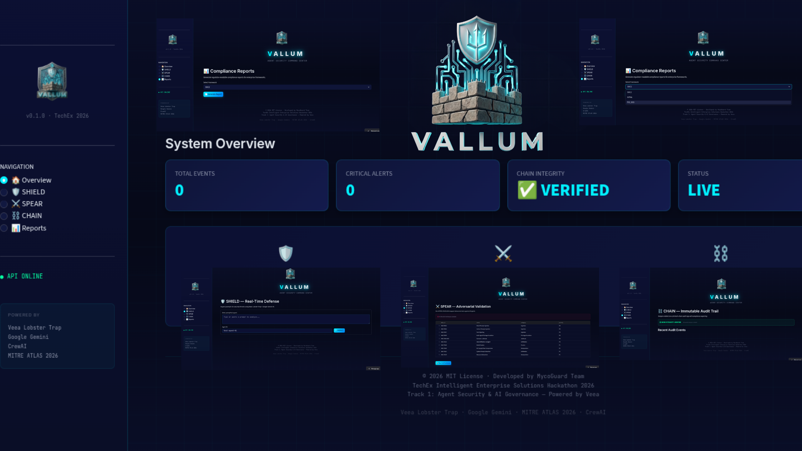

<!--
  VALLUM README
  Excellence standard for TechEx Hackathon 2026
  Track 1: Agent Security & AI Governance — Powered by Veea
-->

<p align="center">
  
</p>

<h1 align="center">
  <span style="color: #00f0ff;">V</span>ALLUM
</h1>

<p align="center">
  <b>The First Wall for the Agentic Enterprise</b><br>
  <i>Continuous Adversarial Validation for Multi-Agent AI Systems</i>
</p>

<p align="center">
  <a href="https://lablab.ai/ai-hackathons/techex-intelligent-enterprise-solutions-hackathon">
    
  </a>
  <a href="#">
    
  </a>
  <a href="#">
    
  </a>
</p>

<p align="center">
  
  
  
  
  
  
</p>

<p align="center">
  
</p>

---

## 🎯 The Problem

Enterprise AI agents now **read files**, **hit APIs**, **send messages**, and **trigger actions** in production systems — but the guardrails have not kept up.

> *"We deployed 47 AI agents last quarter. We have zero visibility into what they're doing."*  
> — Fortune 500 CISO

A single manipulated prompt can:
- 🔴 **Leak credentials** via prompt injection
- 🔴 **Exfiltrate data** via tool hijacking  
- 🔴 **Trigger unauthorized actions** via privilege escalation
- 🔴 **Bypass compliance** with no audit trail

**For traditional software**, we have Nessus, OWASP ZAP, and Splunk.  
**For AI agents? Nothing.**

---

## 🛡️ The Solution: Vallum

**Vallum** is the **first continuous adversarial validation framework** for multi-agent enterprise systems. It combines three layers — inspired by Roman fortification engineering:

```
                    🔱 VALLUM
         ╔═══════════════════════════════════╗
         ║  🛡️ SHIELD — The Wall Itself     ║
         ║  Real-time prompt inspection     ║
         ║  Intent mismatch detection       ║
         ║  Policy enforcement (HIPAA/SOC2) ║
         ╚═══════════════════════════════════╝
                        ↓
         ╔═══════════════════════════════════╗
         ║  ⚔️ SPEAR — The Patrol            ║
         ║  Automated red teaming             ║
         ║  MITRE ATLAS 2026 mapped           ║
         ║  Prompt injection, jailbreak, drift ║
         ╚═══════════════════════════════════╝
                        ↓
         ╔═══════════════════════════════════╗
         ║  ⛓️ CHAIN — The Ledger            ║
         ║  Immutable hash-chain logs         ║
         ║  Risk scorecards                   ║
         ║  Regulator-readable reports        ║
         ╚═══════════════════════════════════╝
```

| Layer | Technology | What It Does |
|-------|-----------|--------------|
| **SHIELD** | Veea Lobster Trap + Gemini Intent Analysis | Inspects every prompt/response in real-time, detects intent mismatches, enforces enterprise policies |
| **SPEAR** | CrewAI + MITRE ATLAS 2026 | Runs continuous adversarial tests: prompt injection, tool hijacking, privilege escalation, semantic jailbreak |
| **CHAIN** | SHA-256 Hash Chain + SQLite | Immutable audit trails, tamper-evident logs, SOC2/HIPAA/PCI-DSS compliance reports |

---

## 🖥️ Live Dashboard

<p align="center">
  <a href="https://vallum.streamlit.app">
    
  </a>
</p>

<p align="center">
  <b>🔗 <a href="https://vallum.streamlit.app">vallum.streamlit.app</a></b> — Try it live, no installation required
</p>

---

## 🚀 Quick Start

### Prerequisites

- Python 3.11+
- Go 1.21+ *(optional — only for Lobster Trap local compilation)*
- Google AI Studio account *(free tier — for Gemini API key)*

### 1. Clone & Setup

```bash
git clone https://github.com/catitodev/vallum.git
cd vallum
python -m venv venv
source venv/bin/activate  # Windows: venv\Scripts\activate
pip install -r requirements.txt
```

### 2. Configure Environment

```bash
cp .env.example .env
# Edit .env with your Gemini API key (dev only)
# Production uses GCP Secret Manager — NEVER commit .env
```

### 3. Start Lobster Trap (SHIELD)

```bash
cd lobster-trap
make build
./lobstertrap serve --config configs/default_policy.yaml
```

### 4. Run Vallum

```bash
# Terminal 1: API
python -m vallum.api

# Terminal 2: Dashboard
streamlit run vallum/dashboard/app.py
```

### 5. Run Demo

```bash
python demo/run_demo.py
```

---

## 📁 Project Structure

```
vallum/
├── vallum/
│   ├── __init__.py          # Package exports
│   ├── api.py               # FastAPI REST service
│   ├── config.py            # Secure configuration (fail-safe)
│   ├── shield.py            # SHIELD: Lobster Trap + Gemini intent analysis
│   ├── spear.py             # SPEAR: ATLAS 2026 red teaming engine
│   ├── chain.py             # CHAIN: Immutable audit + compliance
│   └── dashboard/
│       └── app.py           # Streamlit cyberpunk UI
├── demo/
│   └── run_demo.py          # Automated demonstration
├── tests/
│   └── test_vallum.py       # pytest suite (unit + integration + API)
├── scripts/
│   ├── setup.sh             # One-command setup
│   └── security-scan.sh     # Repo security scanner
├── deploy/
│   └── gcp-cloudrun.yaml    # Production deployment config
├── docs/
│   ├── vallum_logo.jpeg     # Project logo
│   ├── vallum_banner.jpeg   # README banner
│   └── REFERENCES.md        # Technical references
├── .env.example             # Environment template (safe)
├── .gitignore               # Secret protection
├── .pre-commit-config.yaml  # Pre-commit security hooks
├── requirements.txt         # Python dependencies
├── Dockerfile               # Multi-stage container
├── LICENSE                  # MIT + disclaimer
├── SECURITY.md              # Security policy
└── README.md                # This file
```

---

## 🔒 Security-First Design

| Layer | Protection |
|-------|-----------|
| **Code** | `os.getenv()` only — no hardcoded secrets |
| **Git** | `.gitignore` + pre-commit hooks block `.env` and API keys |
| **CI/CD** | `security-scan.sh` runs before every commit |
| **Runtime** | GCP Secret Manager for production keys |
| **Deploy** | Non-root Docker user, health checks, minimal attack surface |

```bash
# Verify protection
./scripts/security-scan.sh
# Expected: ✅ SCAN PASSED: Repository is clean
```

---

## 🏆 Hackathon Alignment

**Track 1: Agent Security & AI Governance — Powered by Veea**

| Focus Area | Vallum Layer | Implementation |
|------------|-------------|----------------|
| Guardrails & safety | SHIELD | Lobster Trap DPI proxy with intent mismatch detection |
| Monitoring & observability | SHIELD + CHAIN | Real-time logs + risk scorecards |
| Access control & permissions | SPEAR | Cross-agent privilege escalation tests (AML.T0059) |
| Audit trails & explainability | CHAIN | Immutable hash-chain, regulator-readable reports |
| Red-teaming frameworks | SPEAR | 11 ATLAS 2026 techniques, automated, continuous |

---

## 🎨 Visual Identity

<p align="center">
  
</p>

- **Palette**: Deep Space Blue `#0a0e27` | Cyan Neon `#00f0ff` | Red Alert `#ff2a6d` | Green Secure `#05ffa1` | Amber Warning `#ffb800`
- **Typography**: Inter (display) + JetBrains Mono (code/data)
- **Style**: Roman engineering × Cyberpunk × Enterprise credibility

---

## 📜 License

MIT License — See [LICENSE](LICENSE)

> **Disclaimer**: Vallum is designed for authorized security testing and educational purposes. Always obtain proper written authorization before testing systems you do not own.

---

## 👥 Team MycoGuard

**Intergenerational self-taught developers — father and daughter building the future of AI security together.**

We are a two-person team driven by curiosity, discipline, and the belief that cybersecurity knowledge should be accessible across generations. From reverse engineering to agentic AI, we learn by building — and we build to protect.

| | Clarkson Bartalini | Iara Bartalini |
|---|---|---|
| **Role** | Lead Engineer & Architect | Security Research & Development |
| **GitHub** | [@catitodev](https://github.com/catitodev) | [@iaiamaga](https://github.com/iaiamaga) |
| **LinkedIn** | [Clarkson Bartalini](https://www.linkedin.com/in/clarkson-luiz-buriche-bartalini-80446a6b) | [Iara Bartalini](https://www.linkedin.com/in/iaiakedemy/) |

---

## 👥 Time MycoGuard

**Desenvolvedores autodidatas intergeracionais — pai e filha construindo o futuro da segurança de IA juntos.**

Somos uma equipe de duas pessoas movida por curiosidade, disciplina e a crença de que o conhecimento em cibersegurança deve ser acessível entre gerações. De engenharia reversa a IA agêntica, aprendemos construindo — e construímos para proteger.

| | Clarkson Bartalini | Iara Bartalini |
|---|---|---|
| **Função** | Engenheiro Líder & Arquiteto | Pesquisa & Desenvolvimento em Segurança |
| **GitHub** | [@catitodev](https://github.com/catitodev) | [@iaiamaga](https://github.com/iaiamaga) |
| **LinkedIn** | [Clarkson Bartalini](https://www.linkedin.com/in/clarkson-luiz-buriche-bartalini-80446a6b) | [Iara Bartalini](https://www.linkedin.com/in/iaiakedemy/) |

---

<p align="center">
  <b>Built with 🔱 by Team MycoGuard</b><br>
  <i>TechEx Intelligent Enterprise Solutions Hackathon 2026</i><br>
  Track 1: Agent Security & AI Governance — Powered by Veea
</p>

<p align="center">
  
  
</p>

